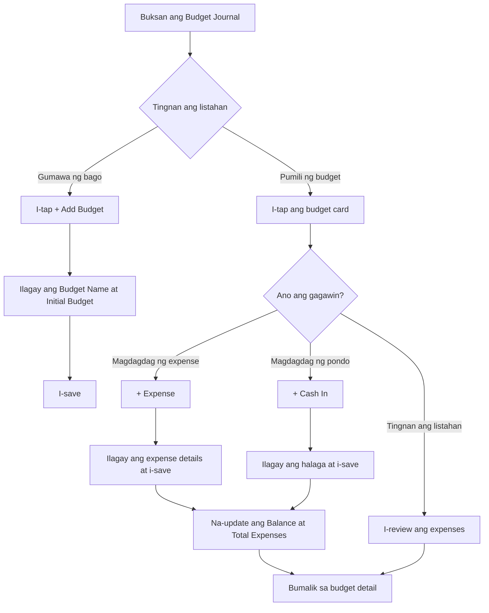

# How to use Budget Journal

Ang **Budget Journal** ay isang feature ng PandanPOS na tumutulong sa iyo na subaybayan ang iyong **personal o tindahan na budget**. Dito mo makikita ang iyong mga budget, expenses, at matitirang pera.

---

## Mga Makikita sa Budget Journal

### Budget List Screen (Image 1)

- **Search bar** – Hanapin ang specific budget sa pamamagitan ng pangalan
- **Budgets count** – Halimbawa: `Budgets (1)` – isang budget ang kasalukuyang naka-setup
- **Budget card** – Ipinapakita ang summary ng bawat budget:

| Field | Description | Example |
|-------|-------------|---------|
| **Budget Name** | Pangalan ng budget | SALARY |
| **Created at** | Petsa at oras ng paggawa | March 11, 2026 - 10:11PM |
| **Transactions** | Bilang ng mga expense o cash in entries | 4 |
| **Balance** | Natitirang pera mula sa budget | ₱17,450.00 |

### Budget Detail Screen (Image 2)

Kapag ni-tap mo ang isang budget, makikita mo ang detalyadong view:

- **Budget Name** – Sa itaas (hal. **Salary**)
- **Action Buttons**:
  - **+ Expense** – Magdagdag ng bagong gastos
  - **+ Cash In** – Magdagdag ng pera sa budget (dagdag pondo)
- **Current Budget** – Kabuuang halaga ng budget (hal. **₱20,000.00**)
- **Balance** – Natitirang pera (₱17,450.00)
- **Total Expenses** – Kabuuang nagastos (₱2,550.00)
- **Expenses List** – Listahan ng mga gastos na may halaga:
  - Gas Allowance – ₱500.00
  - Load Allowance – ₱100.00
  - Water Bill – ₱750.00
  - Electric Bill – ₱1,200.00

---

## Step-by-Step: Paano Gamitin ang Budget Journal

### Paggawa ng Bagong Budget

1. Pumunta sa **Budget Journal** mula sa dashboard o menu.
2. Hanapin ang **+ Add Budget** button (karaniwang nasa ibaba o itaas ng listahan).
3. Ilagay ang:
   - **Budget Name** – Hal. "Salary", "Groceries", "Utilities"
   - **Initial Budget** – Hal. ₱20,000
4. I-save ang budget.

### Pagdaragdag ng Expense

1. Piliin ang budget na gusto mong lagyan ng expense.
2. I-tap ang **+ Expense** button.
3. Ilagay ang detalye:
   - **Expense Name** – Hal. "Gas Allowance"
   - **Amount** – Hal. ₱500
   - (Optional) **Notes** o **Category**
4. I-tap ang **Save**.
5. Makikita mo agad na nag-update ang **Total Expenses** at **Balance**.

### Pagdaragdag ng Cash In (Dagdag Pondo)

1. Sa loob ng budget, i-tap ang **+ Cash In**.
2. Ilagay ang halaga ng idadagdag na pera.
3. I-save.
4. Tataas ang **Current Budget** at **Balance**.

### Pag-edit o Pag-delete ng Expense

1. Sa listahan ng expenses, i-tap ang specific expense.
2. Piliin ang **Edit** para baguhin ang pangalan o halaga.
3. Piliin ang **Delete** para tanggalin ang expense.
4. Mag-a-update ang kabuuang balance.

### Pag-search ng Budget

1. Sa Budget List screen, gamitin ang **Search budget name** field.
2. I-type ang pangalan ng budget (hal. "Salary").
3. Lilitaw lamang ang mga budget na tugma sa search.

---

## Paano Kinukuwenta ang Balance

- **Current Budget** – Ang kabuuang perang inilaan para sa budget na ito (kasama na ang mga na-Cash In).
- **Total Expenses** – Kabuuan ng lahat ng gastos na naitala.
- **Balance** = Current Budget – Total Expenses

Halimbawa:
- Current Budget: ₱20,000
- Total Expenses: ₱2,550
- Balance: ₱17,450

---

## Tips para sa Epektibong Paggamit ng Budget Journal

✅ **Gumawa ng hiwalay na budget para sa iba't ibang kategorya** – Hal. "Personal", "Tindahan", "Utilities"

✅ **Mag-set ng monthly budget** – Gamitin ang Budget Journal para sa monthly allocation ng pera

✅ **I-monitor ang expenses araw-araw** – Para iwas sobra sa budget

✅ **Gamitin ang Cash In kung may dagdag na pondo** – Halimbawa, kung may bonus o extra income

✅ **I-review ang expenses weekly** – Para malaman kung saan napupunta ang pera at makapag-adjust

---

## Troubleshooting

| Problema | Solusyon |
|----------|----------|
| Hindi makapag-add ng expense | Siguraduhing may laman ang budget at hindi zero ang Current Budget. I-check kung may internet connection. |
| Mali ang balance | I-verify ang mga expenses at cash in entries. I-edit o i-delete ang maling entry. |
| Hindi lumalabas ang bagong budget | I-refresh ang page o restart ang app. Siguraduhing na-save ito ng maayos. |
| Nakatagong budget sa search | I-clear ang search field para makita ang lahat ng budget. |
| Hindi maka-delete ng expense | I-check kung may permission ang user (kung multi-user). Subukan ulit. |

---

## Sample Budget Journal Flow

---

*May tanong tungkol sa Budget Journal? Mag-email sa jeromevillaruel1998@icloud.com*