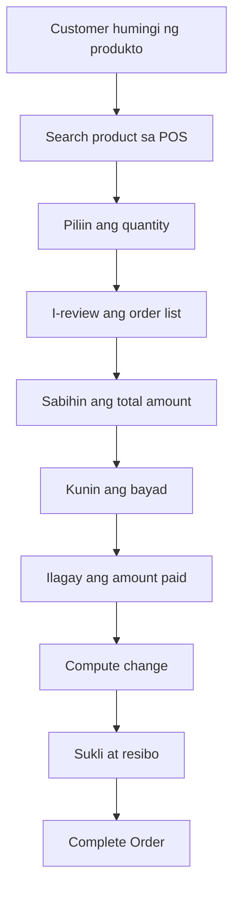

# Creating an Order

Gamit ang PandanPOS, napakadaling gumawa ng order para sa iyong customer. Piliin lang ang produkto, ilagay ang quantity, at kusang magko-compute ang total amount.

---

## Step-by-Step: Paano Gumawa ng Order

### 1. Mag-search ng Produkto

Sa POS screen, makikita mo ang **search bar** sa itaas.

- I-type ang **product code** (barcode o item code) o **product name**
- Lalabas ang matching products habang nagta-type ka
- I-tap ang product para maidagdag ito sa order list

### 2. Piliin ang Quantity

Kapag na-tap mo ang produkto, puwede mong baguhin ang **quantity**:

- I-tap ang product sa order list para i-edit ang quantity
- Puwede ring i-tap ang **+** at **-** buttons para mag-add o magbawas
- Automatic mag-u-update ang subtotal

### 3. I-review ang Order List

Sa image, makikita mo ang sample order na may apat na item:

| Item | Details | Price | Qty | Subtotal |
|------|---------|-------|-----|----------|
| **555 Carne norte (50)** | 260 g | ₱44.00 | x1 | ₱44.00 |
| **Ligo Sardines Green (50)** | 425 g | ₱46.00 | x1 | ₱46.00 |
| **Fresca Tuma Caldereta (50)** | 175 g | ₱6.00 | x1 | ₱6.00 |
| **Fresca Tuma Caldereta (50)** | 175 g | ₱22.00 | x1 | ₱22.00 |

**Total Amount:** ₱118.00

### 4. Kunin ang Payment

Sa ibaba ng screen, makikita ang:

- **Total Amount** – Kabuuang babayaran
- **Amount Paid** – Ilagay dito ang perang ibinigay ng customer
- **Change** – Automatic magko-compute ang sukli

Halimbawa:
- Total Amount: ₱118.00
- Amount Paid: ₱200.00
- Change: ₱82.00

### 5. I-complete ang Order

- Pagkatapos ilagay ang amount paid, i-tap ang **Pay** o **Complete Order**
- Mag-ge-generate ng resibo ang system
- Puwede mong i-print o i-send sa customer

---

## Mga Tips para sa Mabilis na Transaction

✅ **Quick Search** – Gamitin ang barcode scanner o i-type ang pangalan ng produkto para mabilis ma-add

✅ **Multiple Quantity** – Puwede mong i-tap ng paulit-ulit ang product para mag-add ng same item nang hindi na nagse-search ulit

✅ **Check ang Total** – Siguraduhing tama ang total bago kumuha ng payment

✅ **Exact Amount** – Puwede ring i-tap ang "Exact" button kung eksaktong pera ang ibinigay ng customer

---

## Troubleshooting

| Problema | Solusyon |
|----------|----------|
| Hindi lumalabas ang product sa search | Siguraduhing nasa inventory ang product at may stock |
| Mali ang price | I-check ang product details sa Products section at i-update kung kinakailangan |
| Nakalimutan ang barcode | Gamitin ang product name sa search bar |
| Nagbago isip ni customer | I-tap ang trash icon sa tabi ng product para tanggalin sa order |

---

## Sample Transaction Flow

---

## Related Topics

- [Downloading Receipts](/docs/receipts)
- [Understanding the Dashboard](/docs/dashboard)
- [Managing Products](/docs/manage-products)

---

*May tanong? Mag-email sa jeromevillaruel1998@icloud.com*