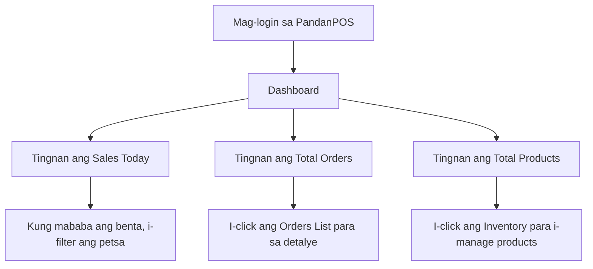

# Dashboard Overview

Ang **Dashboard** ay makikita sa Menu ng PandanPOS. Dito mo makikita ang summary ng iyong tindahan — mula sa benta ngayong araw, bilang ng orders, hanggang sa kabuuang produkto sa inventory.

---

## Mga Makikita sa Dashboard

### 1. Store Name at Date Filter
- Sa itaas, makikita mo ang pangalan ng iyong tindahan (hal. **Pandan Store Name**)
- Sa tabi nito ay ang **date filter** — puwede mong piliin kung anong petsa ang gusto mong i-display
- Default na naka-set sa **ngayong araw** (hal. March 11, 2026)

### 2. Sales Today
- Ipinapakita ang kabuuang benta para sa napiling petsa
- Halimbawa: **₱118.00** — ibig sabihin, ₱118 ang kinita ngayong araw

### 3. Total Orders Today
- Bilang ng orders na na-process ngayong araw
- Halimbawa: **1 order** — isang customer ang bumili

### 4. Go to Orders List →
- I-click ito para makita ang **listahan ng lahat ng orders**
- Puwede mong i-filter ayon sa petsa, status, o customer

### 5. Total Products
- Kabuuang bilang ng produkto sa iyong inventory
- Halimbawa: **389 products** — lahat ng nasa tindahan, kasama ang may stock at walang stock

### 6. View Inventory →
- I-click ito para makita ang **buong listahan ng iyong produkto**
- Dito mo puwedeng i-edit, i-add, o i-delete ang products

---

## Step-by-Step: Paano Gamitin ang Dashboard

### Pag-filter ng Petsa
1. I-tap ang **Filter by date** sa itaas
2. Piliin ang gusto mong petsa (hal. March 11, 2026)
3. Awtomatikong mag-u-update ang **Sales Today** at **Total Orders Today** batay sa napiling petsa

### Pagsusuri ng Sales
- Tingnan ang **Sales Today** para malaman kung kumikita ba ngayong araw
- Kung mababa ang benta, puwede mong i-compare sa nakaraang araw gamit ang date filter

### Pag-check ng Orders
- I-tap ang **Go to Orders List →** para makita ang details ng bawat order
- Dito mo makikita kung ano ang binili ng customer, magkano, at kung kumpleto na ang payment

### Pag-manage ng Inventory
- I-tap ang **View Inventory →** para makita ang listahan ng produkto
- Kung may bagong dating na paninda, i-click ang **Add Product** para i-add sa inventory
- Kung may product na ubos na, puwede mong i-update ang stock quantity

---

## Troubleshooting

| Problema | Solusyon |
|----------|----------|
| Hindi naglo-load ang dashboard | I-check ang internet connection. I-refresh ang page o restart ang app. |
| Mali ang sales figure | Siguraduhing tama ang napiling petsa sa filter. I-check kung may mga unpaid orders na hindi kasama. |
| Hindi lumalabas ang total products | I-verify kung may products na na-delete o na-archive. Pumunta sa Inventory at i-check ang listahan. |

---

## Dashboard Tips

✅ **Daily Check** – Simulan ang araw sa pagtingin ng Dashboard para malaman agad ang target sales

✅ **Compare Performance** – Gamitin ang date filter para i-compare ang benta kahapon vs ngayon

✅ **Quick Actions** – Gamitin ang **Go to Orders List** at **View Inventory** para mabilis na ma-access ang madalas gamitin na sections

---

## Sample Dashboard Flow

---

## Related Topics

- [Creating an Order](/docs/create-order)
- [Adding Products Without a Barcode](/docs/manual-products)
- [Managing Inventory](/docs/manage-products)
- [Sales Reports](/docs/reports)

---

*May tanong tungkol sa Dashboard? Mag-email sa jeromevillaruel1998@icloud.com*