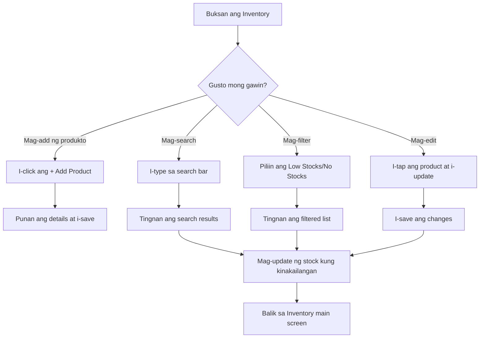

# Inventory Management

Ang **Inventory** section ng PandanPOS ay kung saan mo makikita at mamamahala ang lahat ng iyong produkto. Dito mo maaaring i-add, i-edit, i-monitor, at i-filter ang iyong mga paninda.

---

## Mga Makikita sa Inventory Screen

### 1. Search Bar
- Sa itaas ng screen, makikita mo ang **"Search product name"**
- I-type ang pangalan ng produkto para mabilis itong mahanap
- Puwede ring mag-search gamit ang **barcode** o **item code**

### 2. Product Filters
May tatlong filter options para madaling makita ang specific na klase ng produkto:

| Filter | Description |
|--------|-------------|
| **All** | Lahat ng produkto (default view) |
| **Low Stocks** | Mga produktong paubos na ang stock |
| **No Stocks** | Mga produktong ubos na o wala nang stock |

### 3. Inventory Count
- Makikita sa tabi ng "Inventory" ang kabuuang bilang ng produkto
- Halimbawa: **Inventory (389)** — ibig sabihin, may 389 na produkto sa kabuuan

### 4. Add Product Button
- Ang **+ Add Product** button ay nasa kanang bahagi
- I-click ito para magdagdag ng bagong produkto sa inventory

### 5. Product List
Bawat produkto sa listahan ay may sumusunod na impormasyon:

- **Barcode/Item Code** – Hal. `748485801919` (nasitaas)
- **Product Name** – Hal. `555 Carne norte`
- **Weight/Size** – Hal. `(260 g)` (nasa parentheses)
- **Price** – Hal. `₱44.00`

### 6. Stock Status Indicators
May mga color-coded indicators para sa stock status:

| Indicator | Meaning |
|-----------|---------|
| 🟢 **Normal** | Sapat ang stock (green) |
| 🟡 **Low Quantity** | Paubos na ang stock (yellow) |
| 🔴 **No Stock** | Ubos na ang stock (red) |

---

## Step-by-Step: Paano Gamitin ang Inventory

### Pag-search ng Produkto
1. I-tap ang **Search product name** field
2. I-type ang pangalan ng produkto (hal. "555 Carne")
3. Lilitaw lamang ang mga produktong tugma sa iyong search
4. I-clear ang search para bumalik sa buong listahan

### Pag-filter ng Produkto
1. Piliin ang gustong filter sa itaas:
   - **All** – Para makita lahat
   - **Low Stocks** – Para sa mga paubos na
   - **No Stocks** – Para sa mga ubos na
2. Awtomatikong mag-a-update ang listahan batay sa napiling filter

### Pag-add ng Bagong Produkto
1. I-click ang **+ Add Product** button
2. Punan ang product details:
   - Product name
   - Price
   - Barcode (optional, pwedeng auto-generate)
   - Stock quantity
   - At iba pang details
3. I-click ang **Save** para i-save

### Pag-edit ng Produkto
1. Hanapin ang produktong gusto mong i-edit
2. I-tap ang product sa listahan
3. I-update ang details (presyo, stock, description, atbp.)
4. I-click ang **Save** para i-save ang changes

### Pag-delete ng Produkto
1. Hanapin ang produktong gusto mong tanggalin
2. I-tap ang product para buksan ang details
3. Hanapin ang **Delete** option (karaniwang nasa ibaba)
4. I-confirm ang pag-delete

---

## Stock Status Guide

### Normal (Green)
- Ibig sabihin: **Sapat ang stock** para sa normal na benta
- Walang kailangang gawin, pero maganda pa ring i-monitor

### Low Quantity (Yellow)
- Ibig sabihin: **Paubos na** ang produkto
- Dapat kang **mag-order** ng panibagong supply
- I-check kung gaano kabilis maubos ang item para ma-estimate ang next order

### No Stock (Red)
- Ibig sabihin: **Ubos na** ang produkto
- Kailangan mong **mag-restock** agad kung madalas itong bilhin
- Puwede ring i-archive o itago ang product kung hindi na ibebenta

---

## Tips para sa Efficient Inventory Management

✅ **Regular na Pag-check** – Tingnan ang inventory araw-araw para malaman agad kung may paubos na

✅ **Gamitin ang Filters** – Gamitin ang Low Stocks filter para mabilis malaman kung anong produkto ang kailangang i-order

✅ **Update agad ang Stock** – Pag may bagong dating na paninda, i-update agad ang stock quantity

✅ **Consistent na Naming** – Gamitin ang consistent na format sa product names para madaling mag-search (hal. "555 Carne norte 260g")

✅ **Regular na Price Check** – I-verify kung tama pa ang presyo lalo na pag may promo o price change

---

## Troubleshooting

| Problema | Solusyon |
|----------|----------|
| Hindi mahanap ang produkto sa search | I-check kung tama ang spelling. Gamitin ang barcode imbes na pangalan. |
| Mali ang lumalabas na stock | I-edit ang product at i-update ang stock quantity. Siguraduhing naka-save. |
| Hindi maka-add ng product | I-check kung may internet connection. I-refresh ang page at subukan ulit. |
| Hindi lumalabas ang filter results | I-clear ang search field kung may laman. I-tap ulit ang filter. |
| May duplicate na produkto | I-edit o i-delete ang isa. Pagsama-samahin ang stocks kung kinakailangan. |

---

## Sample Inventory Workflow

---

## Related Topics

- [Creating an Order](/docs/create-order)
- [Adding Products Without a Barcode](/docs/manual-products)
- [Sales Reports](/docs/reports)

---

*May tanong tungkol sa Inventory? Mag-email sa jeromevillaruel1998@icloud.com*