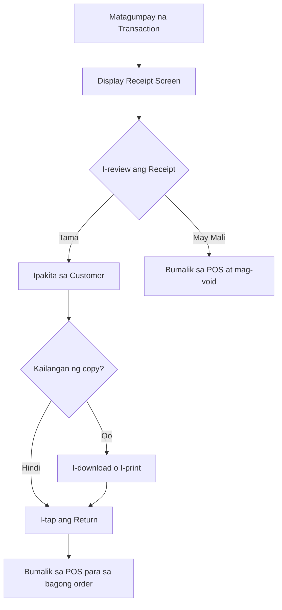

# Downloading Receipts

Pagkatapos ng matagumpay na transaction, mag-ge-generate ang PandanPOS ng **Order Receipt**. Ito ay summary ng binili ng customer, kabuuang halaga, at sukli.

---

## Mga Makikita sa Order Receipt

### 1. Store Information
- **Store Name** – Pangalan ng iyong tindahan (makikita sa itaas)
- Halimbawa: `Store Name` (dito lalabas ang pangalan na iyong inilagay sa setup)

### 2. Reference Number
- May **Ref no.** na natatanging code para sa bawat transaction
- Format: `PAN-` followed by random letters/numbers
- Halimbawa: **PAN-4TROMOJJ**
- Gamitin ito kung kailangan mong i-search o i-reference ang order sa future

### 3. Transaction Status
- **Transaction Successful** – Nagpapakita na matagumpay ang payment
- Ibig sabihin: Nakumpleto ang order at nai-record na sa system

### 4. Order Details
Makikita dito ang listahan ng mga biniling produkto:

- **Item count** – Hal. `Order Details (4) items` (4 na produkto ang binili)

Bawat item ay may sumusunod na impormasyon:
- **Product Name** – Hal. `555 Carne norte`
- **Weight/Size** – Hal. `260 g` (nasa ilalim ng pangalan)
- **Price at Quantity** – Hal. `₱44.00 x 1`
- **Subtotal** – Hal. `= ₱44.00`

Halimbawa ng sample receipt:
| Item | Details | Computation |
|------|---------|-------------|
| **555 Carne norte** | 260 g | ₱44.00 x 1 = ₱44.00 |
| **Ligo Sardines Green** | 425 g | ₱46.00 x 1 = ₱46.00 |
| **Jolen** | 175 g | ₱6.00 x 1 = ₱6.00 |
| **Fresca Tuma Caldereta** | 175 g | ₱22.00 x 1 = ₱22.00 |

### 5. Payment Summary
Sa ibabang bahagi ng receipt:

| Item | Halaga |
|------|--------|
| **Total Amount** | ₱118.00 (kabuuang bill) |
| **Amount Pay** | ₱200.00 (perang ibinigay ng customer) |
| **Change** | ₱82.00 (sukli) |

### 6. Action Buttons
Sa pinakailalim ng screen:

| Button | Function |
|--------|----------|
| **Return** | Bumalik sa POS screen para sa bagong transaction |
| **Download Receipt** | I-save ang receipt bilang PDF o image |

---

## Step-by-Step: Pagkatapos ng Transaction

### 1. I-review ang Receipt
- Pagkatapos mag-pay, automatic lalabas ang receipt screen
- I-verify kung tama ang:
  - Listahan ng produkto
  - Presyo ng bawat item
  - Kabuuang halaga
  - Sukli

### 2. Ibigay sa Customer
- Puwede mong ipakita ang receipt sa customer sa phone screen
- O kaya ay i-download at i-print para ibigay

### 3. I-download ang Receipt (kung kailangan)
1. I-tap ang **Download Receipt** button
2. Piliin kung saan mo gustong i-save:
   - Bilang PDF (para i-print o i-share)
   - Bilang image (para i-send sa messaging app)
3. I-save sa device

### 4. Mag-umpisa ng Bagong Transaction
- I-tap ang **Return** button
- Babalik ka sa POS screen
- Puwede nang gumawa ng panibagong order para sa susunod na customer

---

## Paano Gamitin ang Reference Number

Ang **Ref no.** ay mahalaga para sa:

- **Pagta-track ng orders** – Hanapin ang specific transaction sa Orders List
- **Returns o Refunds** – Kung magbabalik ng produkto ang customer, gamitin ang ref no. para mahanap ang original order
- **Customer inquiries** – Kung may tanong ang customer tungkol sa binili nila kanina

Para mag-search gamit ang reference number:
1. Pumunta sa **Orders List**
2. Gamitin ang search bar
3. I-type ang ref no. (hal. PAN-4TROMOJJ)
4. Lilitaw ang kaukulang order

---

## Receipt Options

### Return Button
- **Function**: Bumalik sa POS main screen
- **Kailan gagamitin**: Pagkatapos ipakita ang receipt sa customer at handa nang mag-umpisa ng bagong order

### Download Receipt Button
- **Function**: I-save ang receipt sa device
- **File formats**: PDF o PNG (image)
- **Puwede ring**: I-share directly sa messaging apps (Facebook Messenger, Viber, WhatsApp)

---

## Tips para sa Receipts

✅ **I-download para sa records** – Magandang mag-download ng receipts para sa daily sales records lalo na kung walang printer

✅ **I-send sa customer** – Kung gusto ng customer ng digital copy, i-download at i-send sa kanila

✅ **I-check ang ref no.** – Bago mag-close ng transaction, tandaan o i-note ang reference number para sa future reference

✅ **I-print kung may printer** – Kung may Bluetooth o WiFi printer, puwede ring i-print ang receipt

---

## Troubleshooting

| Problema | Solusyon |
|----------|----------|
| Hindi lumalabas ang receipt | I-check kung successful ang transaction. Pumunta sa Orders List at hanapin ang order. |
| Error sa pag-download | Siguraduhing may internet connection. I-clear ang cache o restart ang app. |
| Mali ang total amount | I-check ang product prices sa Inventory. I-edit kung mali at mag-issue ng correction receipt. |
| Hindi mahanap ang ref no. | Pumunta sa Orders List at i-filter ayon sa petsa. Hanapin manually kung maraming orders. |
| Gustong mag-print pero walang printer | I-download bilang PDF at mag-send sa computer na may printer. |

---

## Sample Receipt Flow

---

## Related Topics

- [Downloading Sales Reports](/docs/reports)

---

*May tanong tungkol sa Receipts? Mag-email sa jeromevillaruel1998@icloud.com*