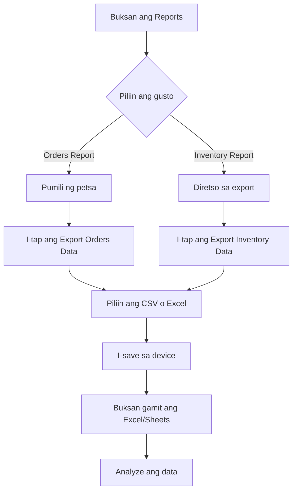

# Downloading Sales Reports and Data Export

Ang **Reports** section ng PandanPOS ay kung saan mo makikita ang buod ng iyong benta at inventory. Dito mo puwedeng i-filter, i-download, at i-export ang iyong datos para sa mas malalim na pagsusuri.

---

## Mga Makikita sa Reports Screen

### 1. Date Filter
- Sa itaas ng screen, makikita mo ang **"Filter Orders Report by date"**
- I-tap ang calendar icon 📅 para pumili ng petsa
- Halimbawa: **March 11, 2026**
- Puwede kang pumili ng:
  - **Specific date** – Para sa isang araw na benta
  - **Date range** – Para sa maraming araw (kung supported)

### 2. Export Options
May dalawang pangunahing pindutan para sa pag-export ng datos:

| Button | Function | File Format |
|--------|----------|-------------|
| **📂 Export Orders Data** | I-download ang listahan ng orders | CSV / Excel |
| **📂 Export Inventory Data** | I-download ang listahan ng produkto | CSV / Excel |

### 3. Instructions
- Sa ibaba ng screen may nakalagay na:
  > "You can view your reports via excel or csv viewer app."
- Ibig sabihin: Puwede mong buksan ang na-download na file gamit ang Excel, Google Sheets, o anumang CSV viewer app sa iyong phone o computer

---

## Step-by-Step: Paano Mag-download ng Reports

### Pag-download ng Orders Report

1. **Pumili ng Petsa**
   - I-tap ang **📅 March 11, 2026** (o kasalukuyang petsa)
   - Piliin ang gusto mong petsa o date range
   - Siguraduhing may transactions sa napiling petsa

2. **I-export ang Orders Data**
   - I-tap ang **📂 Export Orders Data (CSV/Excel)**
   - May lalabas na options kung saan mo gustong i-save:
     - **CSV** – Comma-separated values (mas maliit na file)
     - **Excel** – Microsoft Excel format (may formatting)
   - Piliin ang gusto mong format

3. **I-save ang File**
   - Piliin kung saan folder sa phone mo gustong i-save
   - Puwede rin i-share directly sa:
     - Email
     - Messenger
     - Google Drive
     - At iba pa

### Pag-download ng Inventory Report

1. **I-export ang Inventory Data**
   - I-tap ang **📂 Export Inventory Data (CSV/Excel)**
   - Hindi na kailangan ng date filter dahil ito ay **kasalukuyang inventory**

2. **Piliin ang Format**
   - Piliin ang **CSV** o **Excel**
   - I-save sa device

3. **Buksan gamit ang App**
   - Hanapin ang saved file sa iyong Downloads folder
   - I-tap para buksan gamit ang Excel, Google Sheets, o CSV viewer

---

## Ano ang Nilalaman ng Exported Files?

### Orders Data (CSV/Excel)
Kapag ni-export mo ang Orders Data, makikita mo ang mga sumusunod na columns:

| Column | Description | Example |
|--------|-------------|---------|
| **Reference Number** | Unique order ID | PAN-4TROMOJJ |
| **Date & Time** | Kailan ginawa ang order | 2026-03-11 10:08 AM |
| **Items** | Listahan ng binili | 555 Carne norte (260g) x1 |
| **Quantity** | Kabuuang bilang ng items | 4 items |
| **Total Amount** | Kabuuang halaga | ₱118.00 |
| **Amount Paid** | Perang ibinigay | ₱200.00 |
| **Change** | Sukli | ₱82.00 |
| **Payment Method** | Cash, GCash, etc. | Cash |

### Inventory Data (CSV/Excel)
Kapag ni-export mo ang Inventory Data, makikita mo ang mga sumusunod:

| Column | Description | Example |
|--------|-------------|---------|
| **Barcode/Item Code** | Unique product code | 748485801919 |
| **Product Name** | Pangalan ng produkto | 555 Carne norte |
| **Weight/Size** | Timbang o sukat | 260 g |
| **Price** | Presyo ng benta | ₱44.00 |
| **Stock Quantity** | Kasalukuyang stock | 50 pcs |
| **Status** | Normal / Low / No Stock | Normal |
| **Date Added** | Kailan idinagdag | 2026-01-15 |

---

## Bakit Kailangan Mag-export ng Reports?

### Para sa Orders Data:
- **Inventory Replenishment** – Alamin kung aling produkto ang madalas bumili para mag-order ng panibagong supply
- **Sales Analysis** – Tingnan kung anong araw mataas ang benta
- **Tax Purposes** – Kung kailangan ng records para sa BIR
- **Business Reports** – Para sa partners o investors

### Para sa Inventory Data:
- **Physical Count** – I-compare ang actual stock vs system stock
- **Price Updates** – Madaling i-edit ang maraming presyo nang sabay-sabay
- **Product Audit** – Tingnan kung may mga product na hindi na nabebenta
- **Backup** – Para may kopya ng inventory kung magkaroon ng issue sa app

---

## Tips para sa Reports

✅ **Daily Export** – Mag-export ng orders data araw-araw para may backup

✅ **Weekly Analysis** – I-compare ang benta ngayong linggo vs nakaraang linggo

✅ **Monthly Reports** – Pagsama-samahin ang daily exports para sa monthly report

✅ **Inventory Count** – Mag-export ng inventory data tuwing magfa-physical count

✅ **Use Google Sheets** – Mas madaling mag-analyze kung i-upload sa Google Sheets at gumamit ng pivot tables

---

## Troubleshooting

| Problema | Solusyon |
|----------|----------|
| Walang lumalabas na data sa export | Siguraduhing may orders sa napiling petsa. Kung Inventory, siguraduhing may products. |
| Error sa pag-download | I-check ang internet connection. I-clear ang cache o restart ang app. |
| Hindi mabuksan ang file | Mag-download ng CSV/Excel viewer app sa Play Store o App Store. |
| Mali ang laman ng exported file | I-check kung tama ang napiling date filter. Ulitin ang export. |
| Mabagal mag-download | Kung maraming data, maghintay ng ilang segundo. Puwede ring pumili ng mas maliit na date range. |

---

## Sample Reports Flow

---

## Sample Excel/CSV Analysis Ideas

### Para sa Orders Data:
- **Best Selling Products** – I-sort ang items column para malaman ang madalas bilhin
- **Peak Hours** – I-check ang time column para malaman kung anong oras maraming customers
- **Average Transaction Value** – I-average ang Total Amount column

### Para sa Inventory Data:
- **Slow Moving Items** – I-compare sa orders data kung aling products ang hindi nabebenta
- **Total Inventory Value** – I-multiply ang Stock Quantity sa Price para malaman ang kabuuang halaga ng paninda
- **Reorder Points** – I-tag kung aling products ang dapat i-order

---

*May tanong tungkol sa Reports at Data Export? Mag-email sa jeromevillaruel1998@icloud.com*